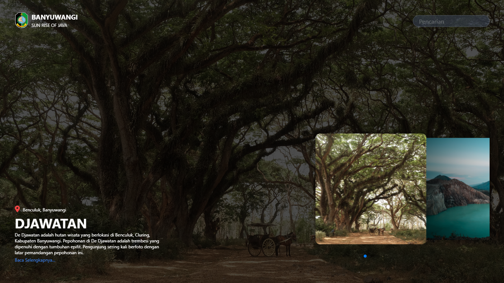
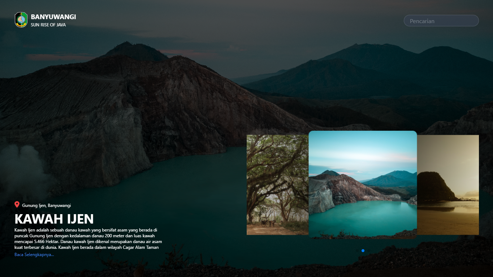

# Testing Vite React (Banyuwangi Tourism Design)

This Repo only for testing Vite React, but you so can clone this repo. This design only for testing and attribute in this
repository maybe have copyright.

## Installation

1. First, you can clone this repo
2. Then `cd viteReact-banyuwangiTourism`
3. Lets install all library `npm install`
4. For developing `npm run dev`

## Interface

This project created by using React Js Framework and Vite.
For create this page, i using tailwindcss and swiper js. Slide of image will autoplay

**FIRST SLIDE**
 This page telling about Djawatan

**SECOND SLIDE**
 This page telling about Ijen
